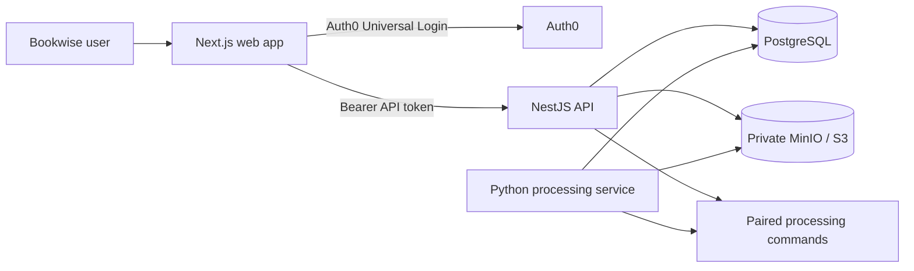
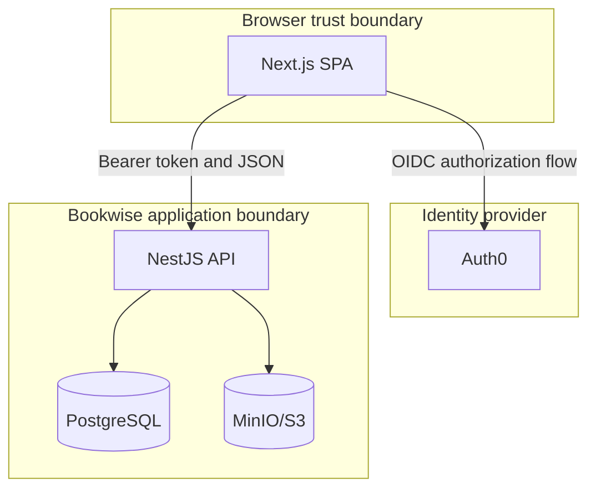
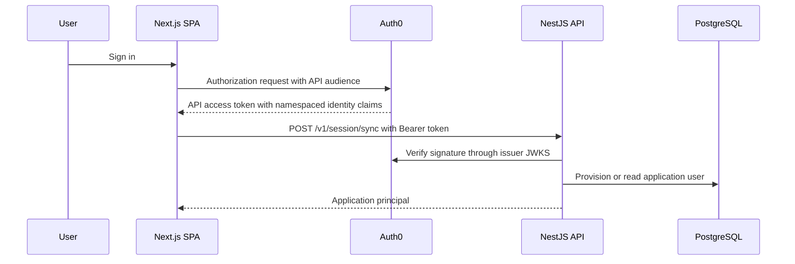
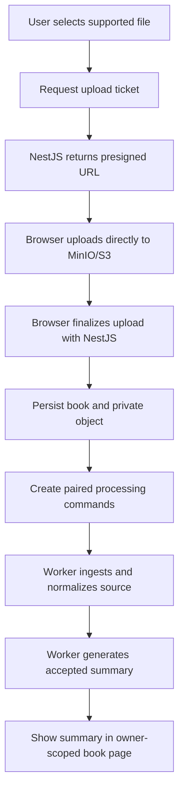

# Bookwise Obsidian Vault Implementation Plan

> **For agentic workers:** REQUIRED SUB-SKILL: Use
> `superpowers:subagent-driven-development` (recommended) or
> `superpowers:executing-plans` to implement this plan task-by-task. Steps use
> checkbox (`- [ ]`) syntax for tracking.

**Goal:** Create a standalone, structured Obsidian vault for Bookwise at
`C:\Users\nguye\Documents\Bookwise` that documents the product, architecture,
engineering practices, workflows, operations, delivery state, and source
material.

**Architecture:** The vault is a portable directory of Markdown notes grouped
by numbered information areas. Two home notes provide navigation, while each
substantive note uses consistent metadata, wikilinks, source references, and
explicit current-versus-planned status. Mermaid diagrams carry the system,
auth, upload, data-model, and delivery visuals so they remain editable.

**Tech Stack:** Obsidian Markdown, YAML frontmatter, Mermaid, PowerShell,
Obsidian desktop application, and the Bookwise repository documentation.

**Spec:** `docs/superpowers/specs/2026-09-07-bookwise-obsidian-vault-design.md`

**Current implementation note (September 17, 2026):** This plan predates the
processing and summary-publication milestones. Any vault created from it must
describe the Python worker, source ingestion, and read-only accepted-summary
publication as current. The real model-provider-backed browser flow remains
pending because no provider is configured.

## Global Constraints

- Create the standalone vault at `C:\Users\nguye\Documents\Bookwise`.
- Keep all authored content in Markdown and use Obsidian wikilinks.
- Use Mermaid diagrams rather than generated binary image files.
- Never include values from `.env`, credentials, tokens, database passwords,
  or other secrets.
- Mark each substantive note as `current`, `planned`, `superseded`, or
  `reference`.
- State that source ingestion and summary publication are current. Finalization
  queues paired `ingest_book` and `regenerate_summary` commands; generation
  waits for normalized source readiness.
- Document the owner-scoped `GET /v1/books/:bookId/summary` API and the
  read-only `/books/[bookId]` summary page with ordered citation locations.
- Include migrations `006_create_current_summary_projections` and
  `007_create_source_document_claim_projection`.
- Do not add or modify automated tests under the repository guidance.
- Leave `.vscode/mcp.json` untracked and unchanged.

---

## File Structure

```text
C:\Users\nguye\Documents\Bookwise\
  00 Home\
    Bookwise.md
    Documentation Map.md
  01 Product\
    Purpose and Scope.md
    User Journeys.md
    Domain Glossary.md
  02 Architecture\
    System Overview.md
    Components and Boundaries.md
    Data Flow.md
    Authentication and Authorization.md
    Data Model.md
  03 Engineering\
    Tech Stack.md
    Repository Map.md
    API Reference.md
    Local Development.md
    Configuration Reference.md
  04 Workflows\
    Private Library Workflow.md
    Upload and Storage Workflow.md
    Processing Pipeline.md
  05 Delivery\
    Timeline.md
    Roadmap.md
    Decisions.md
    Risks and Open Questions.md
  06 Operations\
    Database and Migrations.md
    Storage and MinIO.md
    Troubleshooting.md
    Verification Guide.md
  07 References\
    Source Document Index.md
```

All notes except the two map-of-content notes begin with:

```yaml
---
status: current
last_reviewed: 2026-09-17
source:
  - README.md
---
```

Use `status: planned` for future roadmap and risk items;
`status: superseded` only when noting the old server-session design; and
`status: reference` in the source index.

### Task 1: Create The Vault Skeleton And Navigation

**Files:**
- Create: every directory in the vault file structure.
- Create: `00 Home/Bookwise.md`
- Create: `00 Home/Documentation Map.md`

**Interfaces:**
- Consumes: the approved vault location and hierarchy from the design.
- Produces: a navigable vault root and two maps of content referenced by every
  subsequent note.

- [ ] **Step 1: Create the vault root and all numbered directories**

Run:

```powershell
$vault = 'C:\Users\nguye\Documents\Bookwise'
$directories = @(
  '00 Home',
  '01 Product',
  '02 Architecture',
  '03 Engineering',
  '04 Workflows',
  '05 Delivery',
  '06 Operations',
  '07 References'
)
New-Item -ItemType Directory -Force -Path $vault | Out-Null
$directories | ForEach-Object {
  New-Item -ItemType Directory -Force -Path (Join-Path $vault $_) | Out-Null
}
```

Expected: `C:\Users\nguye\Documents\Bookwise` exists with eight numbered
subdirectories.

- [ ] **Step 2: Write `00 Home/Bookwise.md`**

Create an overview note with:

```markdown
# Bookwise

Bookwise is an evidence-first private book-summarization system. A signed-in
user uploads a supported book to private storage, sees it in a private
library, and receives paired ingestion and summary-generation commands. The
Python worker parses source material, records evidence-linked processing
results, and publishes an accepted immutable summary after normalized source
material is ready.

## Start Here

- [[Documentation Map]]
- [[Purpose and Scope]]
- [[System Overview]]
- [[Private Library Workflow]]
- [[Timeline]]
- [[Roadmap]]

## Current State

The browser-to-NestJS Auth0 token boundary, private upload flow, owner-scoped
library reads, PostgreSQL persistence, MinIO object storage, source ingestion,
and read-only summary publication are implemented. The owner can open
`/books/[bookId]` to read the current accepted summary and citation locations.
A provider-backed browser run remains pending until a model provider is
configured.
```

Include frontmatter with `status: current`, `last_reviewed: 2026-09-17`, and
sources `README.md` and `docs/project-timeline.md`.

- [ ] **Step 3: Write `00 Home/Documentation Map.md`**

Create one section for each numbered folder, with a short purpose sentence and
wikilinks to every note in that folder. Include this top-level grouping:

```markdown
## Product

[[Purpose and Scope]] · [[User Journeys]] · [[Domain Glossary]]

## Architecture

[[System Overview]] · [[Components and Boundaries]] · [[Data Flow]] ·
[[Authentication and Authorization]] · [[Data Model]]
```

Repeat the same pattern for Engineering, Workflows, Delivery, Operations, and
References.

- [ ] **Step 4: Verify root navigation**

Open both home notes and confirm every wikilink resolves to an intended
vault-relative target once the linked files are created. Confirm the first
paragraph describes Bookwise and makes no secret-bearing configuration claim.

- [ ] **Step 5: Record the completed skeleton paths**

Verify that `00 Home/Bookwise.md` and `00 Home/Documentation Map.md` exist
under `C:\Users\nguye\Documents\Bookwise`. The vault is intentionally outside
the repository, so the repository design and implementation plan remain the
Git-tracked record of this external documentation artifact.

### Task 2: Document Product And Architecture

**Files:**
- Create: all files in `01 Product`.
- Create: all files in `02 Architecture`.

**Interfaces:**
- Consumes: navigation notes from Task 1 and the system, service, Auth0, and
  private-library design documents in the repository.
- Produces: an explainable product model, technical boundaries, and five
  diagrams for downstream engineering and operations notes.

- [ ] **Step 1: Write product notes**

Create these notes:

| Note | Required content |
| --- | --- |
| `Purpose and Scope.md` | Evidence-first purpose, current private-library, parsing, and read-only summary-publication workflow, plus explicit exclusions: summary editing, search, question answering, multipart upload, resume, OCR, malware scanning, and files above 100 MiB. |
| `User Journeys.md` | Visitor sign-in/sign-up; authenticated user upload; direct private upload; finalization; owner-scoped library refresh; processing-state visibility; and the current accepted-summary reading journey. |
| `Domain Glossary.md` | Definitions for user, OIDC subject, principal, book, book object, upload ticket, presigned URL, processing command, processing run, processing event, summary, owner scope, and evidence. |

Set `Purpose and Scope.md`, `User Journeys.md`, and `Domain Glossary.md` to
`current`.

- [ ] **Step 2: Write `System Overview.md` with the system context diagram**

Use this diagram:

````markdown

````

Explain that the user-facing web app, API, database, object storage, and Python
worker are current. Summary generation waits for normalized source readiness.

- [ ] **Step 3: Write `Components and Boundaries.md` and `Data Flow.md`**

`Components and Boundaries.md` must identify:

- Next.js as the browser application.
- Auth0 as the identity provider and API token issuer.
- NestJS as the public application API and sole application-schema writer.
- PostgreSQL as the durable application and processing store.
- MinIO/S3 as private object storage.
- The Python service as the current command consumer and sole `data`-schema
  writer.

Include this trust-boundary diagram:

````markdown

````

`Data Flow.md` must describe the browser session-sync call, upload ticket
creation, direct object upload, finalization, paired command creation, library
read, source ingestion, readiness-gated summary generation, and accepted
summary read flow.

- [ ] **Step 4: Write auth and data-model notes**

`Authentication and Authorization.md` must document:

- Auth0 React SDK token acquisition with the configured API audience.
- NestJS signature, issuer, audience, expiry, subject, and namespaced
  verified-email claim checks.
- The `https://bookwise.local/email` and
  `https://bookwise.local/email_verified` claims as names, not values.
- Owner-scoped persistence and API reads.

Include this sequence diagram:

````markdown

````

`Data Model.md` must identify the current `app.users`, `app.books`,
`app.book_objects`, and `app.processing_commands` tables; the Python-owned
processing, source, evidence, and generated-summary records; and the current
accepted-summary and source-readiness projections added by migrations `006`
and `007`. Include a Mermaid entity relationship diagram linking users to
books, objects, commands, source documents, and summaries.

- [ ] **Step 5: Verify content boundaries**

Confirm every current/planned boundary matches
`docs/project-timeline.md`. Search the created notes for `minioadmin`,
`bookwise:bookwise`, `SECRET`, `TOKEN=`, and `CLIENT_ID=`; no secret values
may appear.

- [ ] **Step 6: Record the completed product and architecture paths**

Verify that every file in `01 Product` and `02 Architecture` exists under
`C:\Users\nguye\Documents\Bookwise`. Keep the vault outside the repository;
the repository design and implementation plan provide the change history for
the vault architecture.

### Task 3: Document Engineering, Workflows, Delivery, Operations, And Sources

**Files:**
- Create: all files in `03 Engineering`.
- Create: all files in `04 Workflows`.
- Create: all files in `05 Delivery`.
- Create: all files in `06 Operations`.
- Create: `07 References/Source Document Index.md`.

**Interfaces:**
- Consumes: the context from Tasks 1 and 2 plus repository source documents.
- Produces: operationally useful documentation that makes current behavior,
  verification steps, and future milestones explicit.

- [ ] **Step 1: Write the engineering notes**

Create:

| Note | Required content |
| --- | --- |
| `Tech Stack.md` | Next.js 16, React 19, TypeScript, NestJS 11, Fastify, PostgreSQL 17 with pgvector, MinIO/S3, Redis, Python, and Auth0. |
| `Repository Map.md` | Purpose of `apps/web`, `services/api`, `services/data`, `infrastructure/database`, `docs`, and `docker-compose.yml`. |
| `API Reference.md` | Current endpoints: `POST /v1/session/sync`, `POST /v1/books/uploads`, `POST /v1/books/:bookId/uploads/finalize`, `GET /v1/books`, `GET /v1/books/:bookId/processing`, and `GET /v1/books/:bookId/summary`; describe authentication and response intent without inventing schemas. |
| `Local Development.md` | Install, `.env` setup via `.env.example`, Docker start, migration, web/API start, and Python worker start. Note that real summary generation requires a configured model provider. |
| `Configuration Reference.md` | Names and purposes of public API/Auth0 settings, database URLs, Redis URL, S3 settings, OIDC issuer/audience, and presigned URL expiry. Mark every value as a local example or secret-managed setting; never record actual local values. |

- [ ] **Step 2: Write workflow notes with the upload diagram**

`Private Library Workflow.md` documents user isolation, session synchronization,
library reads, empty state, and queued status.

`Upload and Storage Workflow.md` includes:

````markdown

````

`Processing Pipeline.md` is `current` and defines the worker sequence: safely
claim `ingest_book`, read the private object, parse supported formats, create
processing runs/events and normalized source records, then claim
`regenerate_summary` only after source readiness and persist accepted
evidence-linked summary artifacts.

- [ ] **Step 3: Write delivery and operations notes**

Create:

| Note | Required content |
| --- | --- |
| `Timeline.md` | Reproduce the milestones in `docs/project-timeline.md`, including the September 7, 2026 browser acceptance milestone. Include a Mermaid `timeline` diagram. |
| `Roadmap.md` | Private search and cited Q&A next, then a decision on editable publication and further operational hardening. |
| `Decisions.md` | Record the Auth0 React SPA migration, namespaced access-token claims, NestJS token verification, private direct-to-storage upload, and queued command boundary. |
| `Risks and Open Questions.md` | Track worker idempotency, parsing quality, source-format variance, monitoring, production credentials, malware scanning, OCR, and large/resumable uploads. |
| `Database and Migrations.md` | Document the migration ledger, application/data schemas, migration command, migration safety checks, and migrations `006` and `007`. |
| `Storage and MinIO.md` | Document private bucket intent, presigned upload boundary, local MinIO dependency, and no-public-read rule. |
| `Troubleshooting.md` | Cover missing local services, web environment loading, Auth0 audience/issuer mismatch, missing namespaced token claims, 401 versus 403, bucket provisioning, and migration visibility. |
| `Verification Guide.md` | List static checks, migration checks, signed-in browser check, upload check, paired-command and source-readiness checks, accepted-summary API/page checks, database persistence check, and MinIO object check. Distinguish local static verification from the pending provider-backed browser run. |
| `Source Document Index.md` | List every source document named in the design with its repository path, role, and status. Mark the August 14 server-session plan as superseded. |

- [ ] **Step 4: Verify links, visuals, and note status**

Use Obsidian to open `00 Home/Documentation Map.md`. Confirm:

1. Every map link opens a note.
2. Every Mermaid block renders.
3. Planned notes say `status: planned`.
4. The source index identifies superseded material.
5. The active current state describes parsing and read-only accepted-summary
   publication as implemented without claiming a completed provider-backed
   browser run.

- [ ] **Step 5: Record the completed reference paths**

Verify that every file in `03 Engineering` through `07 References` exists
under `C:\Users\nguye\Documents\Bookwise`. The vault’s contents intentionally
remain outside the repository; do not attempt to stage paths outside the
repository worktree.

### Task 4: Register And Inspect The Standalone Vault

**Files:**
- Verify: `C:\Users\nguye\Documents\Bookwise\`
- Verify: all Markdown files created in Tasks 1 through 3.

**Interfaces:**
- Consumes: the completed vault directory.
- Produces: a Bookwise entry in Obsidian's vault switcher and visual
  confirmation of rendered navigation and diagrams.

- [ ] **Step 1: Add the folder to Obsidian as a vault**

In Obsidian, use **Open another vault** then **Open folder as vault**. Select:

```text
C:\Users\nguye\Documents\Bookwise
```

Expected: Obsidian opens Bookwise and adds it to its local vault registry.

- [ ] **Step 2: Open and inspect the home note**

Open:

```text
00 Home/Bookwise.md
```

Confirm the overview text, current-state section, and linked documentation
map are visible.

- [ ] **Step 3: Inspect all Mermaid notes**

Open:

```text
02 Architecture/System Overview.md
02 Architecture/Components and Boundaries.md
02 Architecture/Authentication and Authorization.md
02 Architecture/Data Model.md
04 Workflows/Upload and Storage Workflow.md
05 Delivery/Timeline.md
```

Expected: each Mermaid block renders without syntax errors and describes only
the current or explicitly planned boundary stated in the note.

- [ ] **Step 4: Verify the standalone vault registry**

Read:

```text
C:\Users\nguye\AppData\Roaming\Obsidian\obsidian.json
```

Expected: its `vaults` map includes the path
`C:\Users\nguye\Documents\Bookwise`.

- [ ] **Step 5: Report the final vault inventory**

Report the vault path, number of notes, diagram count, current in-progress
milestone, and confirmation that no `.env` values or credentials were copied.
